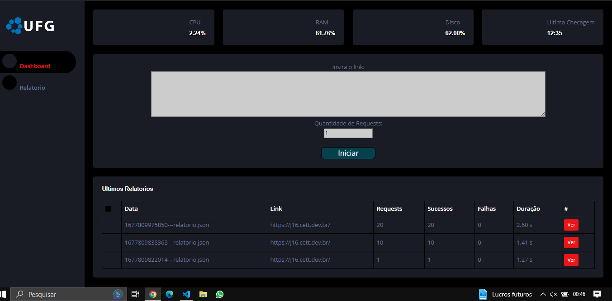
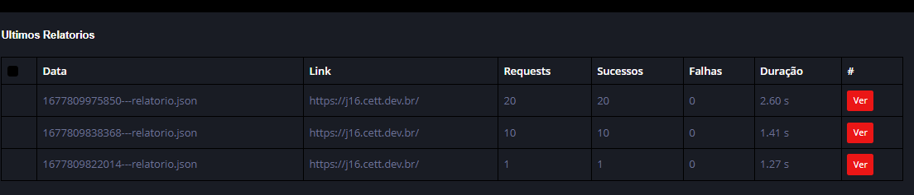
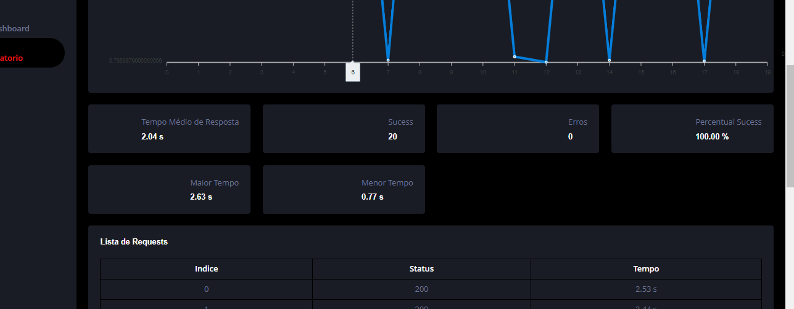

# Aplicação Node.js StressTester 

Este é um projeto básico para uma aplicação Node.js com um servidor e cliente para ser usado como ferramente de teste de estresse em servidores web. 

## Instalação

Antes de começar, certifique-se de ter o Node.js instalado em sua máquina. Caso não tenha, você pode fazer o download da versão mais recente em [nodejs.org](https://nodejs.org).

### Instalação do servidor

1. Clone o repositório em sua máquina: `git clone https://github.com/lRafaelOliveira/my-vue-app.git`.
2. Navegue até a pasta do servidor: `cd my-vue-app/server`.
3. Instale as dependências: `npm install`.
4. Crie um arquivo `.env` baseado no `.env.example` e configure as variáveis de ambiente necessárias.
5. Execute o servidor: `npm start`.

### Instalação do cliente

1. Navegue até a pasta do cliente: `cd my-vue-app/client`.
2. Instale as dependências: `npm install`.
3. Configure o endpoint do servidor no arquivo `.env`.
4. Execute o cliente: `npm start`.

## Instruções de Uso

 

Na tela Inicial Voce encontra as informações do Sistema (Host), alem de uma area para realizar os testes, podendo digitar 1 url, ou varias urls separadas por ; (ponto e virgula). Para Cada url Digitada sera gerado um novo relatorio.

 

Os Relatorios São listados logo abaixo com um Resumo de cada um. Para Ver detalhadamente o Relatorio basta clicar em Ver. 

 

Aqui é a Tela do Relatorio. As informações Acima São as Basícas do Sistema no momento das requisições.
A segunda area de informações é m grafico que mostra o tempo de cada requisição. 

Abaixa é possivel ver as infomações sobre tempo médio, Sucessos, Erros, Tempo maximo, tempo minimo etc... 
Por Ultimo voce tem a listagem de cada requisição individual

## Licença

Este projeto de Código aberto.